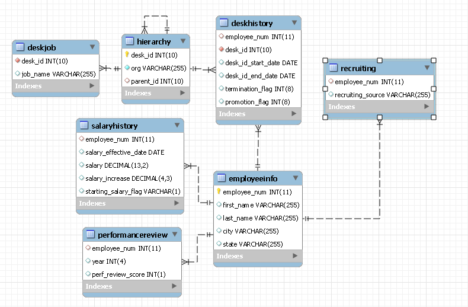

```{r setup, include=FALSE}
knitr::opts_chunk$set(echo = TRUE)
```

The goal of this lab is to use __R__ to manipulate tables. We will use both the _tidyverse_ way with __dplyr__ and the __SQL__ way. We will also learn how to import data from various sources.

We will focus on a fake human resource database made of 7 tables. They have been generated by Harry Hallas on his website http://harry.ahlas.com.

```{r, echo = FALSE, fig.align = "center", out.width = "80%"}

```

# Table manipulation

We will try to answer the following questions:

1. What is the maximum salary?
2. Who was paid this salary?
3. What was the corresponding position?
4. What is the average salary of this position?
5. What is the average salary by position?
6. What are the top 10 average salaries?

## The _tidyverse_ way

In this first section, we will assume we already have the corresponding tables in __R__, we will focus later on the import part. In order to have those tables in your session, a file containing them is provided:
```{r load_tbl}
load("tbls.RData")
```
Note that the file should be in your working directory.

If you are using __RStudio__ as suggested, you should see the 7 tables in the Environment panel.

We are going to use the _tidyverse_, a opinionated collection of packages, to deal with the tables. The functions available in a package can be made available by loading the package with the __library__ function.
```{r tidyverse}
library(tidyverse)
```
Note that you should first install any package you want to used. This has to be done only once using __install.packages__ or the packages panel in __RStudio__.

__dplyr__ is a package loaded by __tidyverse__ that contains a lot of function to handle tables in __R__. For instance, 

- one can look at the structure of a table
```{r glimpse}
glimpse(deskhistory_tbl)
```
- filter a table with a condition
```{r filter}
filter(salaryhistory_tbl, 
       salary_effective_date >= lubridate::dmy("01-01-2000"),
       salary_effective_date <= lubridate::dmy("31-12-2000"))
```
where we have use the __pkg::fct__ notation to call the function __fct__ from the package __pkg__ without making all the functions of __pkg__ available.
- select a few column
```{r select}
select(salaryhistory_tbl,
       employee_num, salary)
```
- create a new column
```{r mutate}
mutate(salaryhistory_tbl,
       salary_effective_year = lubridate::year(salary_effective_date))
```
Note that the table __salaryhistory\_tbl__ is not modified, a new table has been created which should be explicitly saved
```{r store}
salaryhistorymod_tbl <- mutate(salaryhistory_tbl,
       salary_effective_year = lubridate::year(salary_effective_date))
```
- summarize
```{r summarize}
salaryhistorymod_tbl %>% 
  filter(salary_effective_year == 2013) %>% 
  summarize(salary = mean(salary))
```
where we have used the R pipe \%>\% which allows to chain instructions. The previous sequence is equivalent to
```{r summarize_eq}
summarize(filter(salaryhistorymod_tbl, salary_effective_year == 2013), salary = mean(salary))
```
or
```{r summarize_eq2}
tmp <- salaryhistorymod_tbl
tmp <- filter(tmp, salary_effective_year == 2013)
summarize(tmp, salary = mean(salary))
```
- use a group by strategy
```{r group_by}
salaryhistorymod_tbl %>% 
  group_by(salary_effective_year) %>% 
  summarize(mean_salary = mean(salary))
```
- join two tables
```{r left_join}
deskjob_tbl %>% left_join(hierarchy_tbl)
```
Note that the key used to join the table has been chosen automatically as the common column. It can be specified explicitly if required:
```{r left_join_by}
deskjob_tbl %>% left_join(hierarchy_tbl, by = c("desk_id" = "desk_id"))
```

More functions are available has shown in the Data transformation cheat sheet.

We are now almost ready to answer the questions we have. We will first define some alias for our tables
```{r alias_tbl}
deskhistory <- deskhistory_tbl
deskjob <- deskjob_tbl
employeeinfo <- employeeinfo_tbl
hierarchy <- hierarchy_tbl
performancereview <- performancereview_tbl
recruiting <- recruiting_tbl
salaryhistory <- salaryhistory_tbl
```


1. What is the maximum salary?

<div class="hiddensolution">
```{r max_salary_tbl}
max_salary <- salaryhistory %>% 
  summarize(max_salary = max(salary))
max_salary
```
</div>


2. Who was paid this salary?

<div class="hiddensolution">
```{r who_tbl}
who_max_salary <- salaryhistory %>%
  top_n(1, salary) %>% 
  left_join(employeeinfo) %>% 
  select(first_name, last_name, everything())
who_max_salary 

salaryhistory %>% 
  inner_join(max_salary, by = c("salary" = "max_salary")) %>% 
  left_join(employeeinfo) %>% 
  select(first_name, last_name, everything())
```
</div>

3. What was the corresponding position?

<div class="hiddensolution">
```{r position_tbl}
position_max_salary <- who_max_salary %>% 
  left_join(deskhistory) %>% 
  filter(salary_effective_date >= desk_id_start_date,
         salary_effective_date < desk_id_end_date) %>% 
  left_join(deskjob) %>% 
  left_join(hierarchy) %>% 
  select(job_name, org, first_name, last_name, everything()) 
position_max_salary
```

</div>

4. What is the average salary of this position?

<div class="hiddensolution">
```{r position_average_salary_tbl}
position_average_salary <- position_max_salary %>% 
  select(desk_id) %>% 
  left_join(deskhistory) %>% 
  left_join(salaryhistory) %>% 
  filter(salary_effective_date >= desk_id_start_date,
         salary_effective_date < desk_id_end_date) %>% 
  summarize(mean_salary = mean(salary))
position_average_salary
```

</div>

5. What is the average salary by position?

<div class="hiddensolution">
```{r average_salary_tbl}
average_salary <- deskjob %>% 
  left_join(hierarchy) %>% 
  left_join(deskhistory) %>% 
  left_join(salaryhistory) %>% 
  filter(salary_effective_date >= desk_id_start_date,
         salary_effective_date < desk_id_end_date) %>%
  group_by(desk_id, job_name, org) %>% 
  summarize(mean_salary = mean(salary)) %>% 
  ungroup()
average_salary
```

</div>

6. What are the top 10 average salaries?

<div class="hiddensolution">
```{r top_tbl}
average_salary_top10 <- average_salary %>%
  top_n(10, mean_salary) %>% 
  arrange(desc(mean_salary))
average_salary_top10

average_salary %>%
  filter(rank(desc(mean_salary))<=10) %>% 
  arrange(desc(mean_salary))

average_salary %>% 
  arrange(desc(mean_salary)) %>% 
  head(10)
```

</div>

## The __SQL__ way

We are now going to use a SQL database to work with the tables. We are going to use __MonetDB__ a not well known database which can be used without a system installation. Note that the __R__ package has been discontinued (but a replacement called __duckdb__ is in progress). To install it, we will use the CRAN Time Machine:
```{r}
if (!("MonetDBLite" %in% installed.packages())) {
  install.packages("MonetDBLite",
                   repos = "https://cran.microsoft.com/snapshot/2019-04-01/")
}
```


You should download the _hrsample_db.zip_ and decompress it in your working directory. The _hrsample_db_ directory contains all the table in the MonetDB format. We can connect to this database from __R__ with:
```{r conn}
library(DBI)
conn <- dbConnect(MonetDBLite::MonetDBLite(),
                  "hrsample_db")
```
Note that both __DBI__ and __MonetDBLite__ should be installed.

We can check that all the tables are available using
```{r check}
dbListTables(conn)
```
If this is not the case, you can either try to check whether _hrsample_db_ is in the right directory or recreate the database from scratch with
```{r recreatedb, eval=FALSE}
dbWriteTable(conn, "deskhistory", deskhistory_tbl)
dbWriteTable(conn, "deskjob", deskjob_tbl)
dbWriteTable(conn, "employeeinfo", employeeinfo_tbl)
dbWriteTable(conn, "hierarchy", hierarchy_tbl)
dbWriteTable(conn, "performancereview", performancereview_tbl)
dbWriteTable(conn, "recruiting", recruiting_tbl)
dbWriteTable(conn, "salaryhistory", salaryhistory_tbl)
```

One can now use __dbGetQuery__ to send SQL queries to the database
```{r getquery}
dbGetQuery(conn,
           "SELECT * FROM deskjob LIMIT 10")
```

Can you answer the questions using SQL?

1. What is the maximum salary?

<div class="hiddensolution">
```{r max_salary_sql}
dbGetQuery(conn, 'SELECT MAX("salary") AS "max_salary"
FROM "salaryhistory"')
```

</div>


2. Who was paid this salary?

<div class="hiddensolution">
```{r who_sql}
dbGetQuery(conn, 
           'WITH max_salary AS (SELECT * FROM (SELECT *, RANK() OVER (ORDER BY "salary" DESC) AS rank 
           FROM "salaryhistory") AS TBL WHERE rank = 1)
           SELECT first_name, last_name, max_salary.employee_num AS employee_num
           , salary_effective_date,
           salary, salary_increase, starting_salary_flag, rank,
           city, state
           FROM "max_salary" LEFT JOIN "employeeinfo" ON
           (max_salary."employee_num" = employeeinfo."employee_num")
           ')

dbGetQuery(conn, 
           'WITH max_salary AS  (SELECT * FROM (SELECT MAX(salary) AS maxsalary FROM salaryhistory) AS TBL 
           JOIN salaryhistory ON (TBL.maxsalary = salaryhistory.salary))
           SELECT first_name, last_name, max_salary.employee_num AS employee_num
           , salary_effective_date,
           salary, salary_increase, starting_salary_flag,
           city, state
           FROM "max_salary" LEFT JOIN "employeeinfo" ON
           (max_salary."employee_num" = employeeinfo."employee_num")
           '
           )
```
</div>

3. What was the corresponding position?

<div class="hiddensolution">
```{r position_sql}
dbGetQuery(conn, 
           'WITH max_salary AS (SELECT * FROM (SELECT MAX(salary) AS maxsalary FROM salaryhistory) AS TBL 
           JOIN salaryhistory ON (TBL.maxsalary = salaryhistory.salary)),
           who_max_salary AS (SELECT first_name, last_name, max_salary.employee_num AS employee_num
           , salary_effective_date,
           salary, salary_increase, starting_salary_flag,
           city, state
           FROM "max_salary" LEFT JOIN "employeeinfo" ON
           (max_salary."employee_num" = employeeinfo."employee_num")),
           who_max_salary_join AS (SELECT * FROM who_max_salary 
           LEFT JOIN deskhistory
           ON (who_max_salary.employee_num = deskhistory.employee_num)),
           who_max_salary_filter AS (SELECT * FROM who_max_salary_join 
           WHERE ((salary_effective_date >= desk_id_start_date)
           AND (salary_effective_date < desk_id_end_date))),
           who_max_salary_join2 AS (SELECT * FROM who_max_salary_filter
           LEFT JOIN deskjob
           ON (who_max_salary_filter.desk_id = deskjob.desk_id))
           SELECT job_name, org, first_name, last_name,
           employee_num, salary_effective_date, salary,
           salary_increase, starting_salary_flag,
           city, state,
           hierarchy.desk_id AS desk_id,
           desk_id_start_date, desk_id_end_date,
           termination_flag, promotion_flag,
           parent_id
           FROM who_max_salary_join2
           LEFT JOIN hierarchy
           ON (who_max_salary_join2.desk_id = hierarchy.desk_id)
           ')
```

</div>

4. What is the average salary of this position?

<div class="hiddensolution">
```{r position_average_sql}
dbGetQuery(conn, 
           'WITH max_salary AS (SELECT * FROM (SELECT MAX(salary) AS maxsalary FROM salaryhistory) AS TBL 
           JOIN salaryhistory ON (TBL.maxsalary = salaryhistory.salary)),
           who_max_salary AS (SELECT first_name, last_name, max_salary.employee_num AS employee_num
           , salary_effective_date,
           salary, salary_increase, starting_salary_flag,
           city, state
           FROM "max_salary" LEFT JOIN "employeeinfo" ON
           (max_salary."employee_num" = employeeinfo."employee_num")),
           who_max_salary_join AS (SELECT * FROM who_max_salary 
           LEFT JOIN deskhistory
           ON (who_max_salary.employee_num = deskhistory.employee_num)),
           who_max_salary_filter AS (SELECT * FROM who_max_salary_join 
           WHERE ((salary_effective_date >= desk_id_start_date)
           AND (salary_effective_date < desk_id_end_date))),
           who_max_salary_join2 AS (SELECT * FROM who_max_salary_filter
           LEFT JOIN deskjob
           ON (who_max_salary_filter.desk_id = deskjob.desk_id)),
           position_max_salary AS (SELECT 
           hierarchy.desk_id AS desk_id
           FROM who_max_salary_join2
           LEFT JOIN hierarchy
           ON (who_max_salary_join2.desk_id = hierarchy.desk_id)),
           position_max_salary_join AS (SELECT * FROM position_max_salary
           LEFT JOIN deskhistory ON 
           (position_max_salary.desk_id = deskhistory.desk_id)),
           position_max_salary_join2 AS (SELECT * FROM position_max_salary_join
           LEFT JOIN salaryhistory ON 
           (position_max_salary_join.employee_num = salaryhistory.employee_num))
           SELECT AVG(salary) AS mean_salary FROM position_max_salary_join2
           WHERE ((salary_effective_date >= desk_id_start_date)
           AND (salary_effective_date < desk_id_end_date))
          ')
```

</div>

5. What is the average salary by position?

<div class="hiddensolution">
```{r average_sql}
dbGetQuery(conn, 
           'WITH 
           position_salary_join AS (SELECT * FROM deskhistory
           LEFT JOIN salaryhistory ON 
           (deskhistory.employee_num = salaryhistory.employee_num)),
           position_mean_salary AS (SELECT desk_id, AVG(salary) AS mean_salary FROM position_salary_join
           WHERE ((salary_effective_date >= desk_id_start_date)
           AND (salary_effective_date < desk_id_end_date))
           GROUP BY desk_id),
           deskjob_hierarchy AS (SELECT * FROM deskjob LEFT JOIN hierarchy
           ON (deskjob.desk_id = hierarchy.desk_id))
           SELECT position_mean_salary.desk_id AS desk_id,
           job_name, org, mean_salary
           FROM position_mean_salary LEFT JOIN deskjob_hierarchy 
           ON (position_mean_salary.desk_id = deskjob_hierarchy.desk_id)
           LIMIT 10
          ')
```

What happens if one remove the LIMIT?

</div>

6. What are the top 10 average salaries?

<div class="hiddensolution">
```{r}
dbGetQuery(conn, 
           'WITH 
           position_salary_join AS (SELECT * FROM deskhistory
           LEFT JOIN salaryhistory ON 
           (deskhistory.employee_num = salaryhistory.employee_num)),
           position_mean_salary AS (SELECT desk_id, AVG(salary) AS mean_salary FROM position_salary_join
           WHERE ((salary_effective_date >= desk_id_start_date)
           AND (salary_effective_date < desk_id_end_date))
           GROUP BY desk_id),
           deskjob_hierarchy AS (SELECT * FROM deskjob LEFT JOIN hierarchy
           ON (deskjob.desk_id = hierarchy.desk_id)),
           position_mean_salary2 AS (SELECT * FROM (SELECT *, RANK() OVER (ORDER BY "mean_salary" DESC) AS rank
           FROM position_mean_salary) tbl
           WHERE (rank <= 10))
           SELECT position_mean_salary2.desk_id AS desk_id,
           job_name, org, mean_salary
           FROM position_mean_salary2 LEFT JOIN deskjob_hierarchy 
           ON (position_mean_salary2.desk_id = deskjob_hierarchy.desk_id)
           ORDER BY mean_salary DESC
          ')
```

</div>

## The _dbplyr_ way

__dplyr__, or rather __dbplyr__, allows to work directly on the distant tables. It suffices to make pointer to those tables:
```{r pointer_tbl}
deskhistory_db <- tbl(conn, "deskhistory")
deskjob_db <- tbl(conn, "deskjob")
employeeinfo_db <- tbl(conn, "employeeinfo")
hierarchy_db <- tbl(conn, "hierarchy")
performancereview_db <- tbl(conn, "performancereview")
recruiting_db <- tbl(conn, "recruiting")
salaryhistory_db <- tbl(conn, "salaryhistory")
```

We can them work with them _as if_ they were in memory:
```{r dbplyr}
deskjob_db
salaryhistory_db %>% filter(salary >= 100000)
```
Note that the computation are performed in the database and only a few records are retrieved in __R__. One should add __collect__ to force a full retrieval as in
```{r collect}
salaryhistory_db %>% 
  filter(salary >= 100000) %>% 
  collect() %>% 
  head(10)
```

Redefining our alias, will help reuse the __dplyr__ code

```{r alias_db}
deskhistory <- deskhistory_db
deskjob <- deskjob_db
employeeinfo <- employeeinfo_db
hierarchy <- hierarchy_db
performancereview <- performancereview_db
recruiting <- recruiting_db
salaryhistory <- salaryhistory_db
```


1. What is the maximum salary?

<div class="hiddensolution">
```{r max_salary_db}
max_salary <- salaryhistory %>% 
  summarize(max_salary = max(salary))
max_salary %>% collect()
```
</div>


2. Who was paid this salary?

<div class="hiddensolution">
```{r who_db}
who_max_salary <- salaryhistory %>%
  filter(rank(desc(salary)) == 1) %>% 
  left_join(employeeinfo) %>% 
  select(first_name, last_name, everything())
who_max_salary %>% collect()
```
</div>

3. What was the corresponding position?

<div class="hiddensolution">
```{r position_db}
position_max_salary <- who_max_salary %>% 
  left_join(deskhistory) %>% 
  filter(salary_effective_date >= desk_id_start_date,
         salary_effective_date < desk_id_end_date) %>% 
  left_join(deskjob) %>% 
  left_join(hierarchy) %>% 
  select(job_name, org, first_name, last_name, everything()) 
position_max_salary %>% collect()
```
</div>

4. What is the average salary of this position?

<div class="hiddensolution">
```{r position_average_salary_db}
position_average_salary <- position_max_salary %>% 
  select(desk_id) %>% 
  left_join(deskhistory) %>% 
  left_join(salaryhistory) %>% 
  filter(salary_effective_date >= desk_id_start_date,
         salary_effective_date < desk_id_end_date) %>% 
  summarize(mean_salary = mean(salary))
position_average_salary %>% collect()
```
</div>

5. What is the average salary by position?

<div class="hiddensolution">
```{r average_salary_db}
average_salary <- deskjob %>% 
  left_join(hierarchy) %>% 
  left_join(deskhistory) %>% 
  left_join(salaryhistory) %>% 
  filter(salary_effective_date >= desk_id_start_date,
         salary_effective_date < desk_id_end_date) %>%
  group_by(desk_id, job_name, org) %>% 
  summarize(mean_salary = mean(salary))
average_salary
```
Note that we do not use __collect__ here on purpose...
</div>

6. What are the top 10 average salaries?

<div class="hiddensolution">
```{r top_db}
average_salary_top10 <- average_salary %>%
  ungroup() %>% 
  filter(rank(desc(mean_salary))<=10) %>% 
  arrange(desc(mean_salary))
average_salary_top10 %>% collect()
```
</div>

### How does __dbplyr__ works?

In the previous examples, __dbplyr__ is preparing a SQL request that is send to the database only when required. One can look at the request using __show\_query__:
```{r show_query}
salaryhistory_db %>% filter(salary >= 100000) %>% 
  show_query()
```
The translation depends on the database used! In particular, some operators are available only in some database. For instance, __RANK__ is not available in SQLite...

We can obtain __lazy__ table directly from SQL query using __tbl__ with __sql__:
```{r tbl_sql}
tbl(conn, sql("SELECT * FROM salaryhistory"))
```


Can you guess the SQL queries prepared by __dbplyr__?

<div class="hiddensolution">
```{r show_query_exercises}
max_salary %>% show_query()
who_max_salary %>% show_query()
position_max_salary %>% show_query()
position_average_salary %>% show_query()
average_salary %>% show_query()
average_salary_top10 %>% show_query()
```
</div>

# Table import/export

We are now looking at some example to import (and export) tables in __R__ from various sources.

## With CSV format

CSV (Comma Separated Values) is a classical file format to exchange data. It consists in text files in which the values are separated by a comma (or sometime another symbols). Often, the first line indicates the names of the columns. This is a simple format in which the column types are not specified and should be _guessed_ by the reader.

In the _tidyverse_, the __readr__ package proposes functions to read (and write) CSV files.
```{r readr}
write_csv(salaryhistory_tbl, "salaryhistory_test.csv")
salaryhistory_csv <- read_csv("salaryhistory_test.csv")
glimpse(salaryhistory_csv)
```
Note that the column type may be slightly different than in the original table.

1. Read and correct the column type for the CSV files of the 7 tables.

<div class="hiddensolution">
```{r csv_read}
library(here)
deskhistory_csv <- read_csv(here("deskhistory.csv"))
deskhistory_csv <- deskhistory_csv %>% 
  mutate_at(vars(-ends_with("date")), as.integer)
deskjob_csv <- read_csv(here("deskjob.csv"))
deskjob_csv <- deskjob_csv %>% 
  mutate_if(is.double, as.integer)
employeeinfo_csv <- read_csv(here("employeeinfo.csv"))
employeeinfo_csv <- employeeinfo_csv %>% 
  mutate_if(is.double, as.integer)
hierarchy_csv  <- read_csv(here("hierarchy.csv"))
hierarchy_csv  <- hierarchy_csv  %>% 
  mutate_if(is.double, as.integer)
performancereview_csv <- read_csv(here("performancereview.csv")) %>% 
  mutate_if(is.double, as.integer)
recruiting_csv <- read_csv(here("recruiting.csv"),
                           col_types = cols(employee_num = col_integer(),
                                            recruiting_source = col_character()))
salaryhistory_csv <- read_csv(here("salaryhistory.csv"),
                              col_types = cols(employee_num = col_integer()))
```

What is the role of __here__?
</div>

2. Can you write them back?

<div class="hiddensolution">
```{r csv_write}
write_csv(deskhistory_tbl, here("deskhistory2.csv"))
write_csv(deskjob_tbl, here("deskjob2.csv"))
write_csv(employeeinfo_tbl, here("employeeinfo2.csv"))
write_csv(hierarchy_tbl, here("hierarchy2.csv"))
write_csv(performancereview_tbl, here("performancereview2.csv"))
write_csv(recruiting_tbl, here("recruiting2.csv"))
write_csv(salaryhistory_tbl, here("salaryhistory2.csv"))
```
</div>

## With xlsx format

1. Use __readxl__  to read the data from the __hrsample.xlsx__.

<div class="hiddensolution">
```{r read_xlsx}
library(readxl)
deskhistory_xl <- read_xlsx(here("hrsample.xlsx"), "deskhistory")
deskhistory_xl <- deskhistory_xl %>% 
  mutate_at(vars(-ends_with("date")), as.integer) %>% 
  mutate_at(vars(ends_with("date")), as.Date)
deskjob_xl <- read_xlsx(here("hrsample.xlsx"), "deskjob")
deskjob_xl <- deskjob_xl %>% 
  mutate_if(is.double, as.integer)
employeeinfo_xl <- read_xlsx(here("hrsample.xlsx"), "employeeinfo")
employeeinfo_xl <- employeeinfo_xl %>% 
  mutate_if(is.double, as.integer)
hierarchy_xl <- read_xlsx(here("hrsample.xlsx"), "hierarchy")
hierarchy_xl <- hierarchy_xl %>% 
  mutate_if(is.double, as.integer)
performancereview_xl <- read_xlsx(here("hrsample.xlsx"), "performancereview") %>% 
  mutate_if(is.double, as.integer)
recruiting_xl <- read_xlsx(here("hrsample.xlsx"), "recruiting")
recruiting_xl <- recruiting_xl %>% 
  mutate_if(is.double, as.integer)
salaryhistory_xl <- read_xlsx(here("hrsample.xlsx"), "salaryhistory") 
salaryhistory_xl <- salaryhistory_xl %>% 
  mutate_at("employee_num", as.integer) %>% 
  mutate_at(vars(ends_with("date")), as.Date)
```
</div>

2. Use __writexl__ to create an excel file.

<div class="hiddensolution">
```{r write_xlsx}
library(writexl)
write_xlsx(
  list(
    deskhistory = deskhistory_tbl,
    deskjob = deskjob_tbl,
    employeeinfo = employeeinfo_tbl,
    hierarchy = hierarchy_tbl,
    performancereview = performancereview_tbl,
    recruiting = recruiting_tbl,
    salaryhistory = salaryhistory_tbl
  ),
  "hrsample2.xlsx"
)
```

</div>

## With a database

1. Read the table from the database

<div class="hiddensolution">
```{r read_db}
deskhistory_tbl2 <- tbl(conn, "deskhistory") %>% collect()
deskjob_tbl2 <- tbl(conn, "deskjob") %>% collect()
employeeinfo_tbl2 <- tbl(conn, "employeeinfo") %>% collect()
hierarchy_tbl2 <- tbl(conn, "hierarchy") %>% collect()
recruiting_tbl2 <- tbl(conn, "recruiting") %>% collect()
salaryhistory_tbl2 <- tbl(conn, "salaryhistory") %>% collect()
```

</div>

2. Write them back

<div class="hiddensolution">
```{r write_db, error=TRUE}
dbWriteTable(conn, "deskhistory", deskhistory_tbl)
dbWriteTable(conn, "deskjob", deskjob_tbl)
dbWriteTable(conn, "employeeinfo", employeeinfo_tbl)
dbWriteTable(conn, "hierarchy", hierarchy_tbl)
dbWriteTable(conn, "performancereview", performancereview_tbl)
dbWriteTable(conn, "recruiting", recruiting_tbl)
dbWriteTable(conn, "salaryhistory", salaryhistory_tbl)
```

Why is there some errors?
</div>

## With another format

There are many different formats. For most of them, there is a function or a package available. For instance,

- __readRDS/saveRdS__ for the native __R__ format.
- __haven__ for SPSS, Stata and SAS formats
- __feather__ for the feather format...

